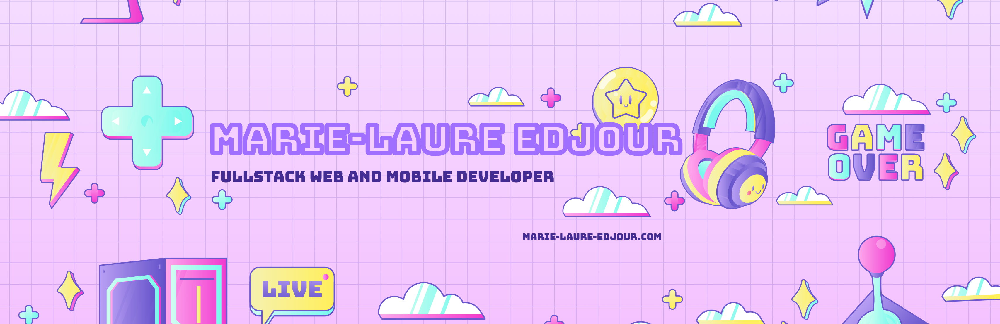

# Bienvenue sur mon profil 👋

## About Me

🎂 Born on December 13, 1998 (25 years old)

I am passionate about web and mobile development. As a fullstack developer, I strive to create exceptional user experiences using a wide range of technologies.

## Skills

- Languages : HTML, CSS, JavaScript, Sass, PHP
- Front-end Frameworks : React, Vue, Next.js
- Back-end Frameworks : Laravel, Nest.js
- Libraries : Three.js
- Databases : MySQL, MongoDB
- Back-end : Node.js, Express
- Mobile : Ionic, React Native

## Experience

As a developer, I have worked on diverse projects, ranging from the development of responsive web applications to the creation of mobile applications with React Native. My fullstack approach enables me to design comprehensive solutions, from the database to the user interface.

## Preferred Technologies

I am particularly excited about working with JavaScript technologies. I love exploring new frameworks and libraries to continually enhance my skills.

## Contact

Feel free to reach out for discussions about collaborations, interesting projects, or just to exchange ideas:

- 📧 Email : [marielaure.edjour@gmail.com](mailto:marielaure.edjour@gmail.com)
- 💼 LinkedIn : [Marie-Laure Edjour](https://www.linkedin.com/in/ml-edjour/)
- 🌐 Website : [marie-laure-edjour.com](https://www.marie-laure-edjour.com)

Thank you for visiting my GitHub profile!  🚀